# 🎬 Cinemate

Application mobile de découverte et gestion de films/séries utilisant l'API TMDB.

## 📱 Fonctionnalités

### Essentielles
- Authentification TMDB
- Catalogue de films et séries
- Détails des œuvres (acteurs, synopsis, notes)
- Gestion des favoris et watchlist

### Bonus
- Recherche avancée
- Lecture des bandes-annonces
- Profils des acteurs
- Animations personnalisées

## 🛠 Technologies

- React Native avec Expo
- React Navigation 6
- AsyncStorage
- TMDB API v3
- React Native Image Picker

## 📂 Structure du Projet

```
cinemate/
├── src/
│   ├── assets/           # Images et ressources
│   ├── components/       # Composants réutilisables
│   │   ├── ui/          # Composants basiques
│   │   └── movies/      # Composants films
│   ├── screens/         # Écrans de l'application
│   │   ├── auth/       # Login, Register
│   │   └── main/       # Home, Search, Profile
│   ├── navigation/      # Configuration des routes
│   ├── services/        # Services API
│   ├── hooks/          # Custom hooks
│   ├── utils/          # Fonctions utilitaires
│   └── theme/          # Thème global
└── App.jsx             # Point d'entrée
```

## 🚀 Installation

```bash
# Cloner le repo
git clone [URL_REPO]
cd cinemate

# Installer les dépendances
npm install
npm install react-native-dotenv

# Configurer les variables d'environnement
cp .env.example .env
# Ajouter votre TMDB_API_KEY dans .env

# Lancer l'application
npx expo start
```

## 🔑 Configuration TMDB

1. Créer un compte sur [TMDB](https://www.themoviedb.org/)
2. Obtenir une clé API:
   - Settings > API > Developer
   - Type: Mobile Application
   - URL: None
3. Ajouter la clé dans .env

## 📱 Écrans Principaux

### Auth
- Login
- Register
- Reset Password

### Main
- Home (Tendances, Populaires)
- Search
- Movie Details
- Profile
- Watchlist

## 🎨 Design System

### Couleurs
```javascript
export const colors = {
  primary: '#2196F3',
  secondary: '#757575',
  background: '#f5f5f5',
  text: '#212121',
  error: '#FF5252'
};
```

### Typography
```javascript
export const typography = {
  h1: { fontSize: 24, fontWeight: 'bold' },
  h2: { fontSize: 20, fontWeight: '600' },
  body: { fontSize: 16 }
};
```

## 🔄 État Global

```javascript
const AppContext = createContext({
  user: null,
  favorites: [],
  watchlist: [],
  // Actions
  addToFavorites: () => {},
  addToWatchlist: () => {}
});
```

## 📝 Conventions de Code

- ESLint + Prettier
- Composants fonctionnels
- Props typées avec PropTypes
- Noms explicites pour les fichiers/composants

## 👥 Équipe

Répartition des tâches par développeur :

### Dev 1 - Setup & Auth
- Configuration initiale
- Système d'authentification
- Gestion des tokens

### Dev 2 - UI & Navigation
- Navigation (Stack + Tab)
- Composants UI réutilisables
- Design système

### Dev 3 - API & State
- Intégration TMDB
- Context/State management
- Optimisation

## 🔐 Sécurité

- Ne pas commit le fichier .env
- Sécuriser la clé API TMDB
- Gérer les tokens d'authentification
- Valider les données entrantes

## 🚧 En Développement

- [ ] Mode hors ligne
- [ ] Tests unitaires
- [ ] Localisation (i18n)
- [ ] Mode sombre
- [ ] Animations avancées

## 📄 License

MIT License - voir [LICENSE.md](LICENSE.md)

## 📱 Screenshots

### Écran de Connexion
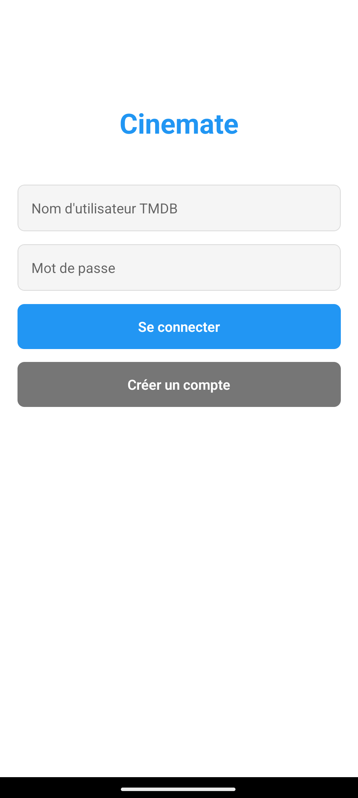

### Écran d'Accueil
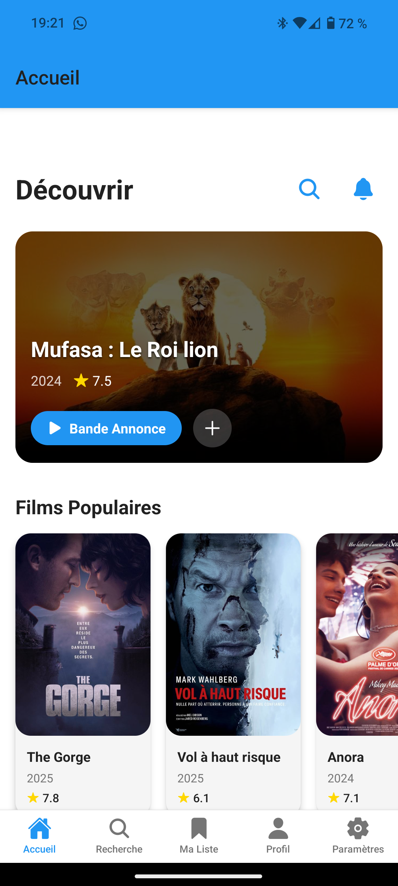

### Écran d'Accueil (darkmode)
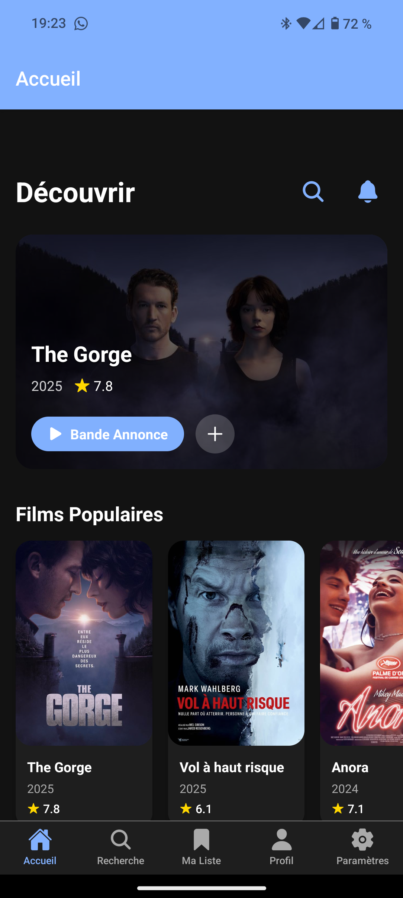

### Détails du Film
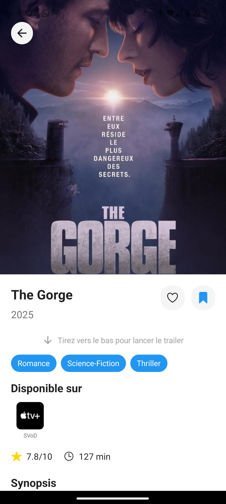
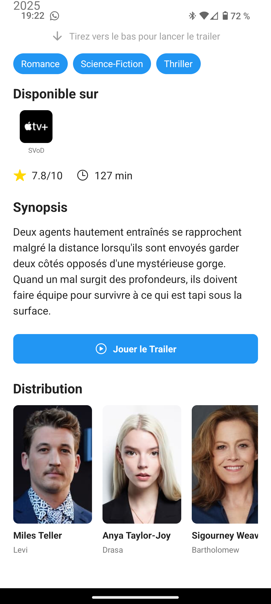

### Détails du Film (darkmode)


### Profil Utilisateur
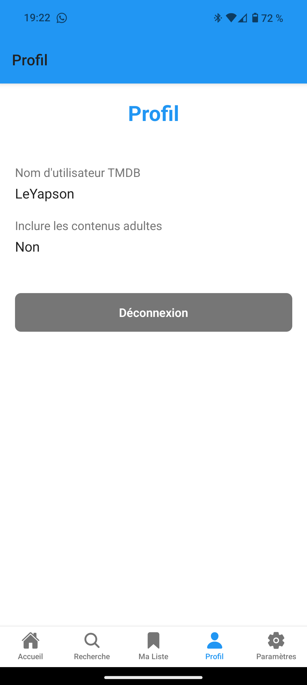

### Profil Utilisateur (darkmode)
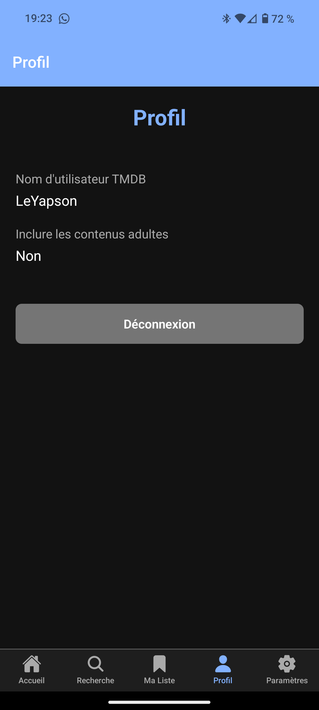

### Recherche
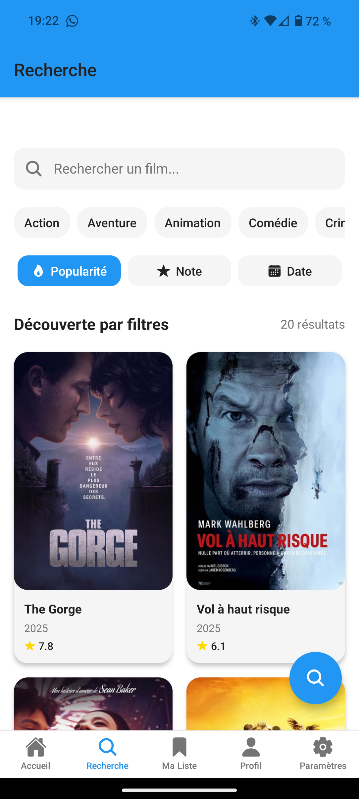

### Recherche (darkmode)
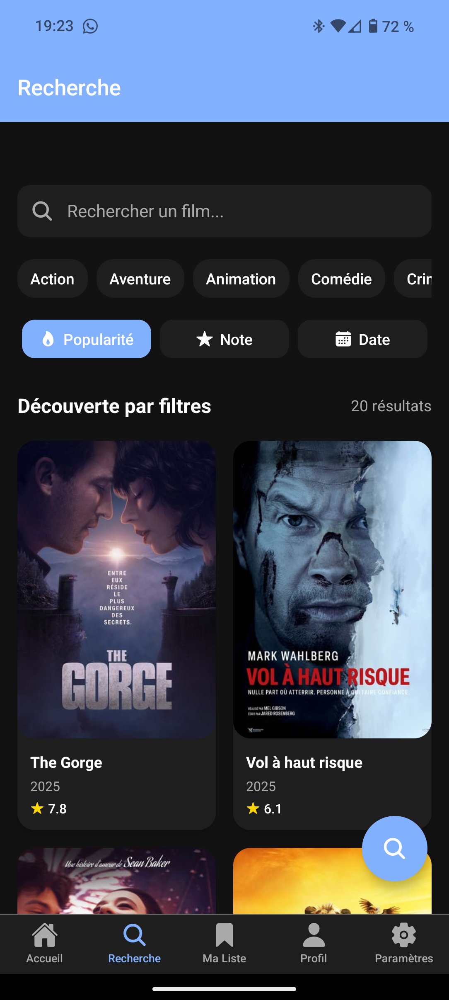

### Watchlist
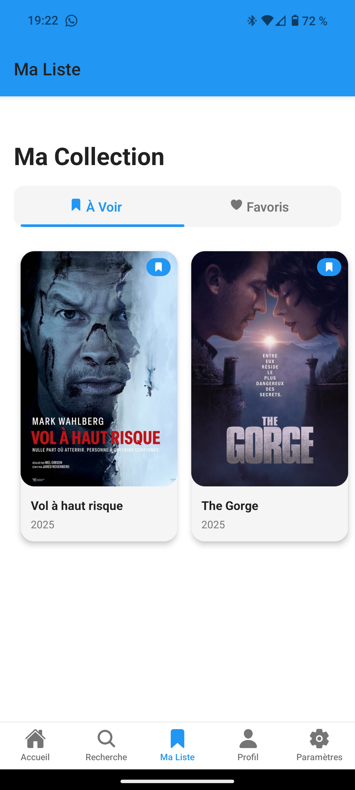
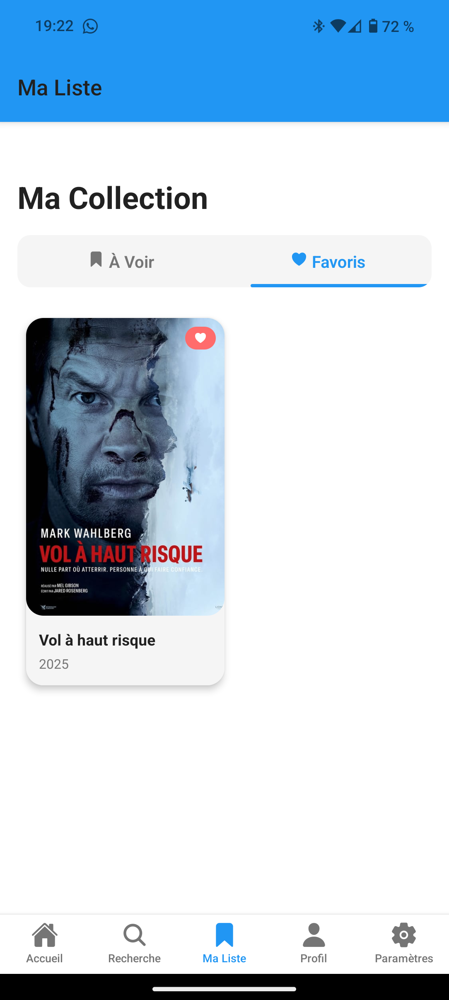

### Watchlist (darkmode)
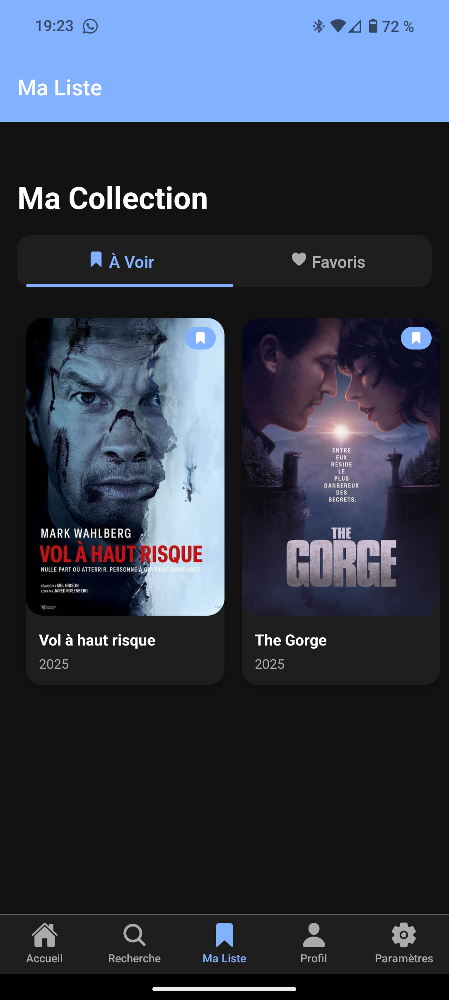
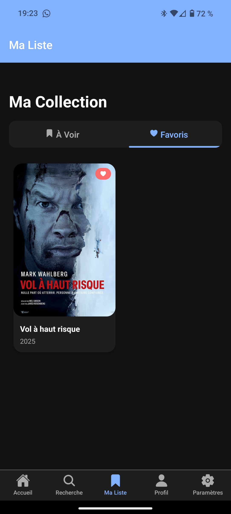

### paramètres
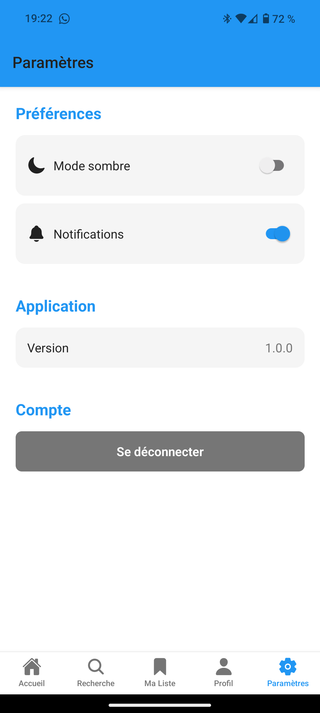

### paramètres (darkmode)
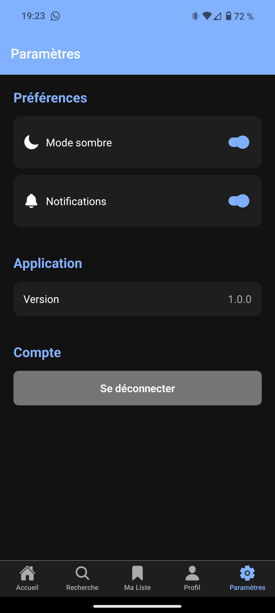

## 🤝 Contribution

1. Fork le projet
2. Créer une branche (`feature/amazing-feature`)
3. Commit (`git commit -m 'Add amazing feature'`)
4. Push (`git push origin feature/amazing-feature`)
5. Ouvrir une Pull Request
